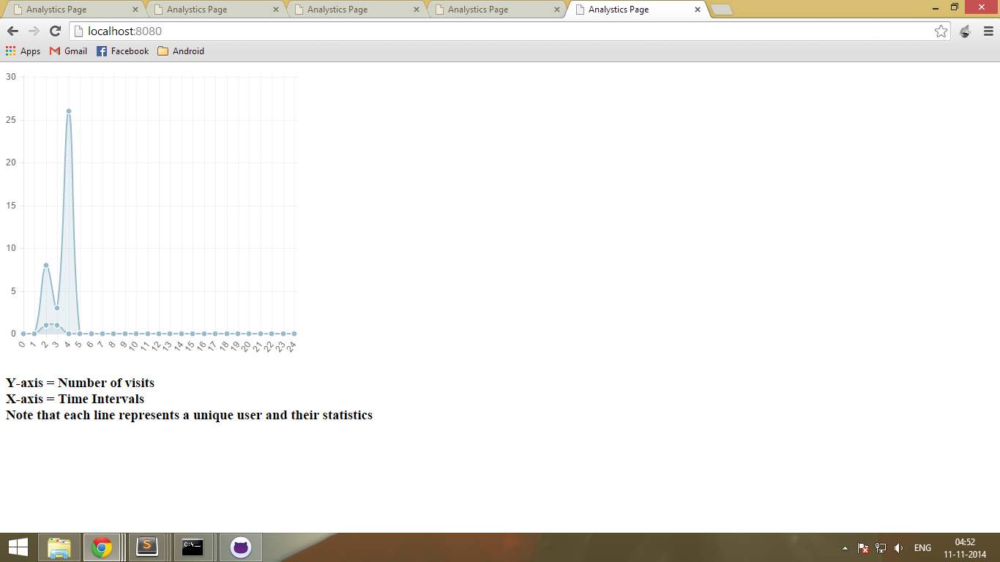

Modules Used
============
  - express
  - mysql
  - socket.io

Description
===========
 - The app uses the IP Address of a user to trace down the number of visits per user within the given intervals of time.
 - MySQL database is used to store the logs
 - Socket.IO is used for realtime updation of the statistics.

Output Screenshot
=================
  
